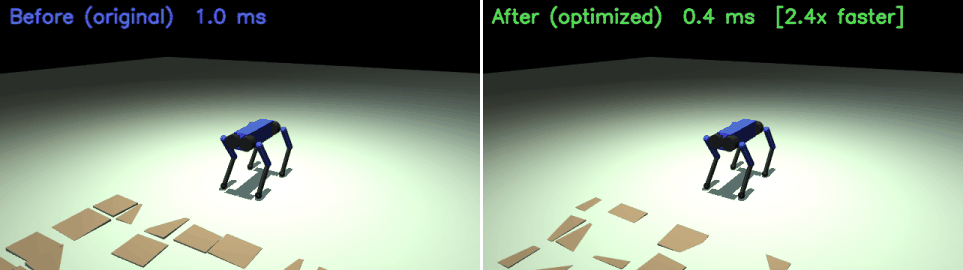

# PGTT — Python Optimization Assignment

Wave Function Collapse (WFC) 기반 지형 생성 코드를 대상으로 Python 자료구조,
제너레이터, 클래스 설계, 데코레이터 기법을 적용해 성능과 구조를 개선한 과제입니다.

## 폴더 구조

```
pgtt/
├── docker/
│   ├── Dockerfile
│   └── docker-compose.yml
├── src/
│   ├── before/                  # 최적화 전 원본 코드
│   │   ├── wfc/wfc.py
│   │   └── terrain/generator.py
│   └── after/                   # 최적화 후 코드
│       ├── wfc/wfc.py
│       ├── terrain/generator.py
│       └── utils/decorators.py
├── benchmark/
│   ├── fixtures/minimal_scene.xml
│   └── run_benchmark.py
├── results/
│   └── benchmark_results.csv    # 실행 후 자동 생성
├── README.md
└── requirements.txt
```

## 적용한 최적화

| 항목 | 대상 | 내용 |
|------|------|------|
| A. 자료구조 | `after/wfc/wfc.py` | `copy.deepcopy` → `np.copyto` / `.copy()` (10-50× 빠름), `list` history → `deque(maxlen=...)`, connections `tuple` → `frozenset` |
| B. Generator | `after/wfc/wfc.py` | `solve()` 를 generator로 변환 — 중간 상태 lazy yield, `run()` 으로 최종 결과 반환 |
| C. 클래스/SRP | `after/wfc/wfc.py` | `WFCCore` → `WFCConfig` (frozen dataclass) + `WFCGrid` (상태) + `WFCCore` (알고리즘) 분리 |
| C. 클래스/SRP | `after/terrain/generator.py` | `TerrainConfig` (frozen dataclass), `BoxData` (dataclass), `RoughGroundBuilder` (벡터화 생성 전략), `TerrainGenerator` (조립만 담당) |
| A. 벡터화 | `after/terrain/generator.py` | `AddRoughGround` 내 N×N 중첩 루프의 개별 random 호출 → 3개 배치 호출 + `np.cumsum` |
| D. 데코레이터 | `after/utils/decorators.py` | `@timing`, `@log_call`, `@validate_grid` — `functools.wraps` 사용 |

## 로컬 실행

```bash
pip install -r requirements.txt
python benchmark/run_benchmark.py
```

## Docker 실행

```bash
docker compose -f docker/docker-compose.yml up --build
```

결과는 `results/benchmark_results.csv` 에 저장됩니다.

## 벤치마크 측정 항목

- **WFC** : 그리드 크기 5×5 ~ 15×15, 각 7회 반복, 평균 + 표준편차
- **AddRoughGround** : 박스 수 5×5 ~ 30×30, 각 7회 반복, 평균 + 표준편차
- 메모리: `tracemalloc` peak KB
- 출력: `results/benchmark_results.csv`

## 로봇 주행 시뮬레이션

최적화된 `AddRoughGround` 지형 위를 Go2-inspired 사족 보행 로봇이 트롯 보행으로 주행하는 MuJoCo 시뮬레이션입니다.



```bash
# Docker로 시뮬레이션 실행 (MP4 + GIF 생성)
docker compose -f docker/docker-compose.yml run simulate
```

결과물: `results/robot_walk.mp4` (30fps, ~9초), `results/robot_walk.gif` (4초 루프)

## 환경

- Python 3.11
- numpy, alive-progress, noise, opencv-python-headless, mujoco, imageio
- JAX / PyTorch 불필요 (벤치마크 대상 코드는 순수 Python/numpy)
